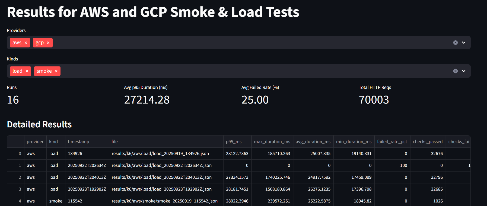
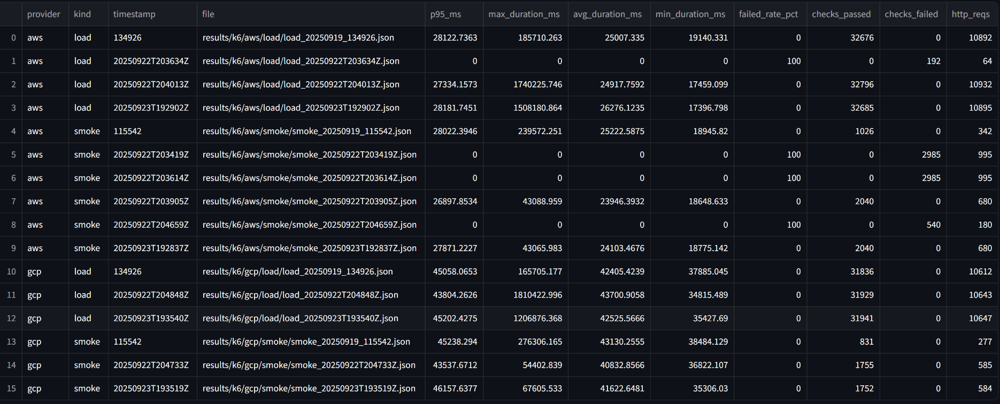
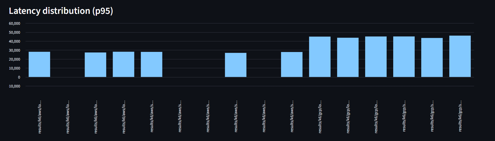
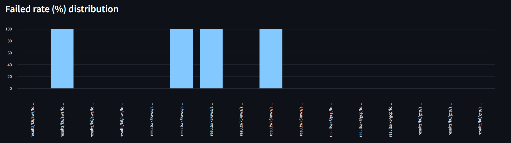

# Multi-Cloud-IaC: AWS + GCP with k6 Tests & Dashboard
Spinning up two identical 'hello' APIs on identical AWS and GCP instances using Terraform, run k6 smoke/load tests against both instances, and view results in the CLI or in a Streamlit dashboard. The Flask app runs inside Docker on each virtual machine and returns simple JSON test results per provider. 


### Requirements
- Terraform > 1.0
- k6 (CLI)
- Python 3.10+ (venv recommended)
- Docker (on cloud instances, installed by the startup scripts)
- GCP: Google Cloud SDK (```gcloud```), a project (you'll pass ```var.project_id```)
- AWS: an account with a default VPC and subnet in your region


## Project Structure
```
multi-cloud-iac/
├─ app/
│ ├─ app.py # Local Flask app 
├─ terraform/
│ ├─ aws/
│ │ └─ main.tf # AWS EC2 + Dockerized Flask
│ └─ gcp/
│ ├─ startup.sh.js # Used in gcp/main.tf    
│ └─ main.tf # GCE + Dockerized Flask (startup.sh)
├─ tests/
│ └─ k6/
│ ├─ smoke.js # Quick health check
│ └─ load.js # Ramp/hold load test
├─ results/
│ └─ k6/
│ ├─ aws/
│ │ ├─ smoke/ # JSON summaries (k6 --summary-export)
│ │ └─ load/
│ └─ gcp/
│ │ ├─ smoke/ # JSON summaries (k6 --summary-export)
│ │ └─ load/
├─ tools/
│ ├─ cli.py # Typer CLI to run tests, export results, launch dashboard
│ └─ viewer.py # Streamlit results dashboard
├─ requirements.txt # All runtime dependencies (CLI + Streamlit + pandas + Flask, etc.)
├─ .gitignore
└─ README.md
```
## Set-Up
### 1. Python Environment and Dependencies
```
# From the repo root (WSL)
python -m venv .venv
source .venv/bin/activate
python -m pip install -r requirements.txt
```


### 2. Provision AWS Instance
``` 
cd terraform/aws
terraform init
terraform apply
```
**Outputs**:```public_ip, service_url (http://X.X.X.X/8080)```


### 3. Provision GCP Instance
```
cd .../gcp
gcloud auth login
gcloud auth application-default login
gcloud config set project <PROJECT_ID>

terraform init
terraform apply -auto-approve -var="project_id=<PROJECT_ID>"
```

**Output**: ```service_url (http://X.X.X.X/8080)```

***Note***: The GCP instance uses ```metadata_startup_script=file("${path.module}/startup.sh")```. 
Make sure ```startup.sh``` uses LF line endings.


### 4. Check Endpoints
```
curl "$(terraform -chdir=terraform/aws output -raw service_url)"
curl "$(terraform -chdir=terraform/gcp output -raw service_url)"
```

**Output should be JSON File with:**```{"ok": true, "cloud": "...", "message": "...", "hostname": "..."}```


## Testing
### Option 1: Direct k6

To run the k6 directly (bash): 
```
# Smoke tests
k6 run tests/k6/smoke.js \
  -e TARGET=http://<AWS_PUBLIC_IP>:8080/ \
  -e EXPECT_CLOUD=aws \
  --vus 5 --duration 10s \
  --tag provider=aws \
  --summary-export results/k6/aws/smoke/smoke_$ts.json

k6 run tests/k6/smoke.js \
  -e TARGET=http://<GCP_PUBLIC_IP>:8080/ \
  -e EXPECT_CLOUD=gcp \
  --vus 5 --duration 10s \
  --tag provider=gcp \
  --summary-export results/k6/gcp/smoke/smoke_$ts.json

# Load tests
  k6 run tests/k6/load.js \
  -e TARGET=http://<AWS_PUBLIC_IP>:8080/ \
  -e EXPECT_CLOUD=aws \
  --tag provider=aws \
  --summary-export results/k6/aws/load/load_$ts.json


  k6 run tests/k6/load.js \
  -e TARGET=http://<GCP_PUBLIC_IP>:8080/ \
  -e EXPECT_CLOUD=gcp \
  --tag provider=gcp \
  --summary-export results/k6/gcp/load/load_$ts.json
```

### Option 2: Python CLI (recommended)

```
# From repo root (venv active)
python tools/cli.py smoke aws
python tools/cli.py load aws

python tools/cli.py smoke gcp
python tools/cli.py load gcp

# Or, both clouds, both smoke and load tests
python tools/cli.py all
```

The CLI prints a short summary table and saves the JSON file to ```results/k6/<provider>/<kind>```. 


# Viewing the Results on Streamlit Dashboard
```
# From repo root (venv active)
streamlit run viewer.py

# Or, run as a CLI command
python tools/cli.py dashboard
```
**Outputs:** URL to view dashboard in browser.


## Dashboard Examples
### Dashboard Overview


### Detailed Results

<a href="docs/csv/example_results_export.csv">Example CSV Export of Results</a>

### AWS vs GCP (p95 latency)


### Fail Rate Distribution

 

## What these tests verify
#### **Smoke Test** ```tests/k6/smoke.js``` 
- HTTP 200 responses
- Response JSON has ```ok: true```
- Check that the ```cloud``` equals the expected provider (```EXPECT_CLOUD```)
- Low and steady concurrency (the default ```--vus``` and ```--duration``` are small)
- Goal: **Correctness and basic reachability**


#### **Load Test** ```tests/k6/load.js```
- Staged traffic: 2m ramp, 3m steady at ~50 VUs, 1m ramp down
- Thresholds:
    - ```http_req_failed``` rate less than 1%
    - Latency: ```p(95)``` less than 300ms
- Same JSON checks (```ok + cloud``` match)
- Goal: **Stability and latency under modest load**


## Extending Providers (Azure etc.,)
- Create ```terraform/azure``` and spin up instance with ```main.tf```
- Return the same ```service_url``` output
- Add the provider to ```DIR_MAP``` variable in ```tools/cli.py```


